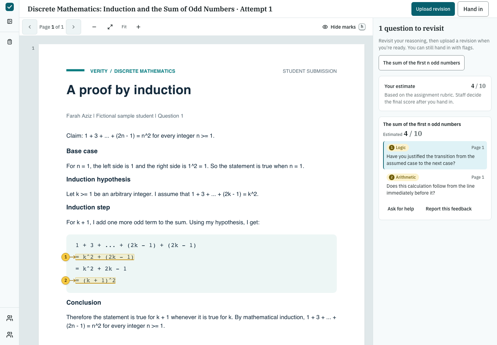
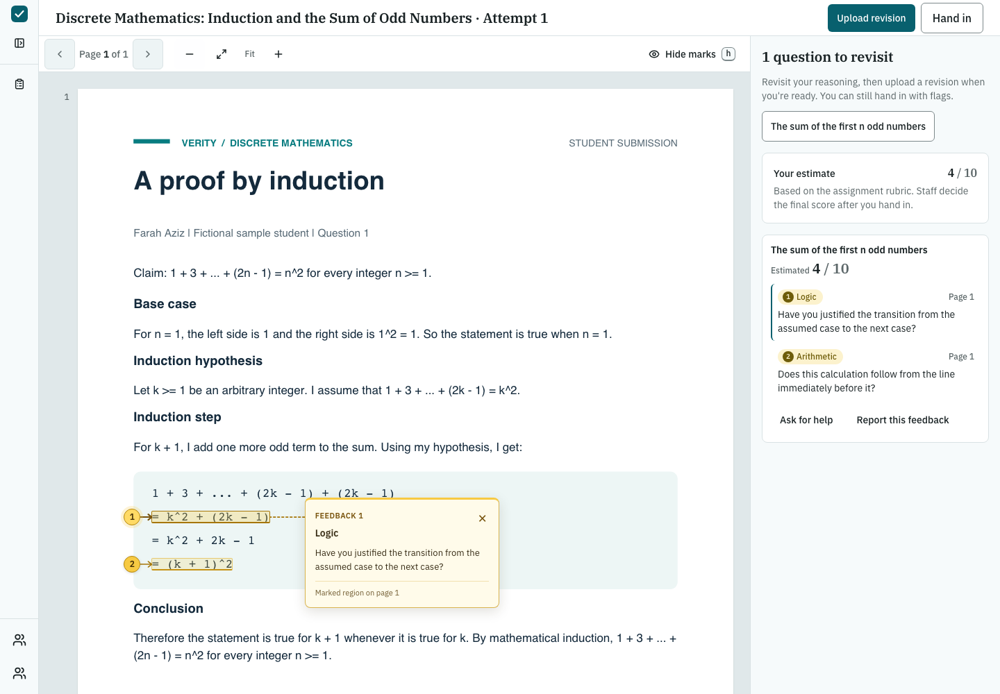
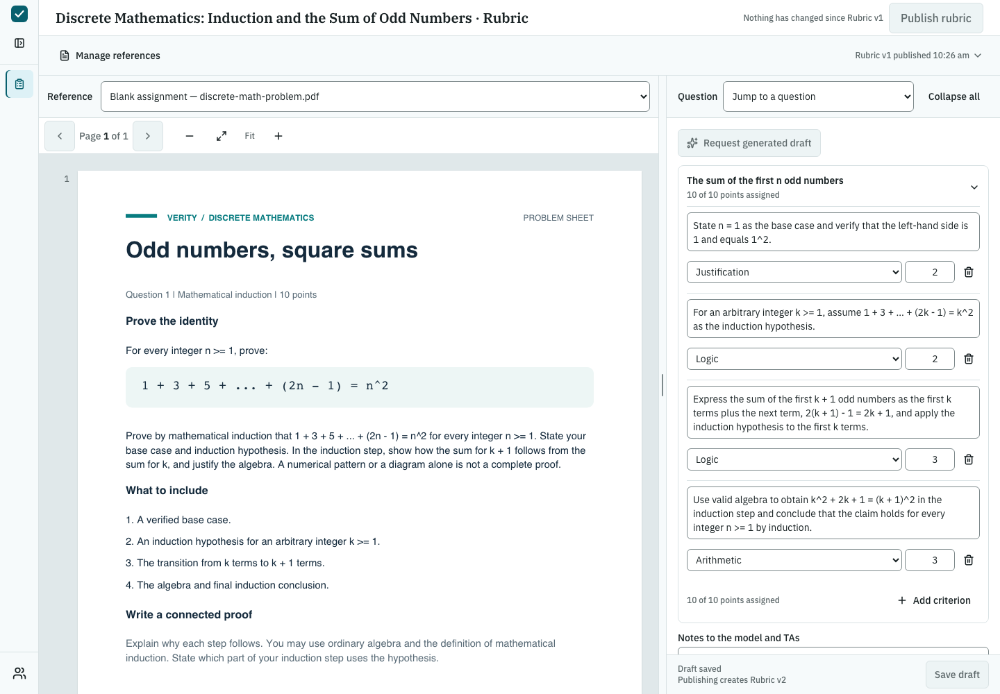

# Discrete math demo: an induction proof

This fictional student submission was assessed through the real Verity API and OpenRouter on
September 20, 2026. Nemotron returned an **estimated 4/10**, matching the independently authored
reference rubric. Both feedback hints were selected by the model from Verity's reviewed catalogue.

## Problem and sample paper

Prove by induction that `1 + 3 + ... + (2n - 1) = n^2` for every integer `n >= 1`.
Farah Aziz's fictional response has a correct base case and induction hypothesis, then repeats
`2k - 1` instead of adding `2k + 1`, and incorrectly identifies `k^2 + 2k - 1` with `(k + 1)^2`.

- [Problem PDF](../../../output/pdf/discrete-math-problem.pdf)
- [Sample student response PDF](../../../output/pdf/discrete-math-student-response.pdf)
- [Instructor guide: correct proof and manual scoring](../../../output/pdf/discrete-math-instructor-guide.pdf)
- [Editable problem, rubric, and response content](../../../tools/discrete_math/content.json)

| Criterion | Available | Model awarded | Manual reference |
| --- | ---: | ---: | ---: |
| Base case | 2 | 2 | 2 |
| Induction hypothesis | 2 | 2 | 2 |
| Correct extension to the next term | 3 | 0 | 0 |
| Valid successor algebra | 3 | 0 | 0 |
| **Total** | **10** | **4** | **4** |

The student received these answer-free hints:

> Have you justified the transition from the assumed case to the next case?

> Does this calculation follow from the line immediately before it?

The original uploaded PDF, extracted text lines, published rubric, asynchronous job, validated
criterion decisions, and student feedback all passed through the application. The backend
computed the score from the model's criterion decisions. The instructor guide and manual score
were excluded from the model inputs. The question and student PDFs were uploaded; the rubric
was authored and published through the API.

This remains a practice submission: no hand-in, human review, or grade release was simulated.
The typed PDF uses measured text-line positions. Numbered arrows point to the incorrect extension
and algebra lines, and yellow highlights show exactly which evidence the model cited. Clicking a
pin opens the corresponding hint beside the error. Documents without measured positions retain
page-level feedback. This one example demonstrates the workflow; it does not measure general
model accuracy. Live model outputs can vary on another run.

## Recorded app views and evidence

The student view shows the submitted paper and its two feedback cards:



Selecting a marker opens its hint next to the highlighted error:



The instructor view shows the published rubric used for the attempt:



- [Run provenance](run.json): provider identity, timestamps, job outcome, input hashes, and comparison.
- [Staff assessment](staff-assessment.json): validated decisions, evidence references, and rationales.
- [Student feedback](student-feedback.json): the student's actual API response.
- [Error locations](error-locations.json): cited student lines and their measured page coordinates.
- [Browser checks](browser-check.json): error highlights compared with PDF.js text positions,
  pointer interaction, zoom alignment, visible hints, published rubric, and console checks.

These exports contain fictional work and no login tokens. Local IDs describe the recorded run;
a fresh run creates new IDs. The provider was `nvidia/nemotron-3-nano-30b-a3b` through the
repository's OpenRouter adapter, with one assessment job and a separate feedback-selection call.

## Run it locally

Use Python 3.12+ and a Node version supported by the frontend. From the repository root:

```sh
python3 -m venv .venv
.venv/bin/python -m pip install -r tools/discrete_math/requirements.txt
test -f .env || cp .env.example .env
```

Set `OPENROUTER_API_KEY` in the ignored `.env` and keep
`VERITY_PROVIDER_FACTORY=verity.openrouter:create_provider`. The live run uses the configured
paid OpenRouter endpoints. It will refuse an unconfigured provider or a fixture provider.

Start the backend in one terminal with the isolated demo data directory:

```sh
VERITY_DATA_DIR=.data/discrete-math PYTHONPATH=backend:. .venv/bin/python -m uvicorn \
  verity.api:create_app --factory --env-file .env --host 127.0.0.1 --port 8026
```

In another terminal, generate the PDFs if you edited the content, then run the demo:

```sh
.venv/bin/python tools/discrete_math/build_pdfs.py
PYTHONPATH=backend:. .venv/bin/python -m tools.discrete_math.run_demo \
  --api http://127.0.0.1:8026 --data-dir .data/discrete-math
```

The runner creates one course, one assignment, instructor Dana Whitfield, and student Farah Aziz.
It writes local sessions to ignored `frontend/.dev/session.json`, publishes the rubric, maps page 1,
and requests one assessment. A fresh invocation creates another course and assessment. If the
command is interrupted, use the following to read the existing job without making another model call:

```sh
PYTHONPATH=backend:. .venv/bin/python -m tools.discrete_math.run_demo --resume
```

Failed jobs are exported and reported; resume does not retry them. The API and runner must use the
same data directory. Demo sessions expire after 72 hours. Re-running replaces the local demo
account switcher configuration while retaining earlier courses in the database.

Start the frontend in its own terminal:

```sh
cd frontend
npm install
npm run dev -- --host localhost
```

Open `http://localhost:5173/session`, choose **Student**, open the assignment, and select the
existing attempt. Use **View as** to switch to **Instructor / TA** and inspect its rubric. The
grading queue remains empty until a student explicitly hands in a paper.

To reproduce the screenshots and browser checks, run from the repository root after both servers
and the demo are ready:

```sh
frontend/node_modules/.bin/playwright install chromium
node tools/discrete_math/capture_demo.mjs
```

Rebuilding inputs or rerunning the demo overwrites the local files in this example; the committed
files preserve the original captured run. All three PDFs were rendered and visually checked.
Backend tests, Python lint/format checks, the frontend build, and the two browser views passed.
